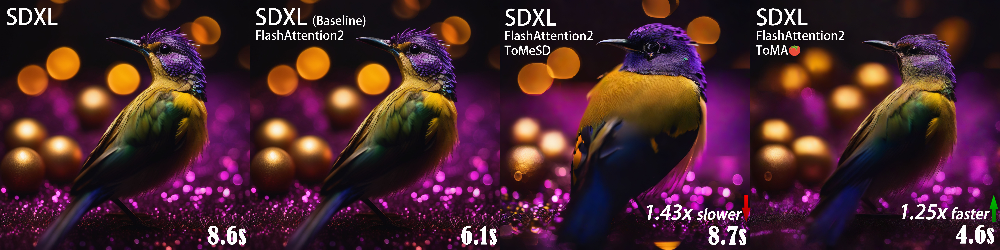
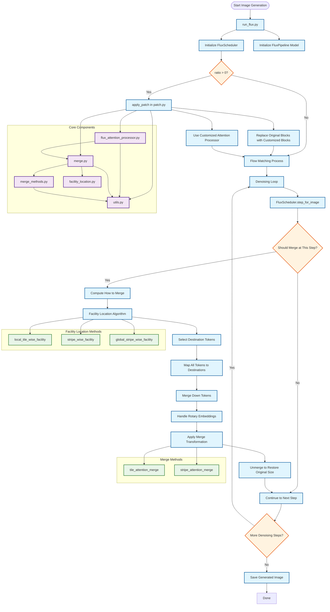

<h1 align="center">ToMA</h1>



This is the official implementation of our paper:  
**[Token Merging with Attention for Diffusion Models](https://icml.cc/virtual/2025/poster/46449)**  
[Wenbo Lu](https://github.com/wenbolu), [Shaoyi Zheng](https://github.com/zhengshaoyi), [Yuxuan Xia](https://github.com/xyxuan), [Shengjie Wang](https://github.com/wangshengjie-ai)  
_[ICML2025 Poster](https://icml.cc/virtual/2025/poster/46449)_ | _[Paper](https://icml.cc/virtual/2025/poster/46449)_ | _[BibTeX](#citation)_ 

ToMA reformulates token merging as a _linear transformation_, enabling a natural implementation within the attention mechanism. Guided by the theoretical guarantees of submodular optimization, our method achieves faster inference with minimal image degradation.


## 🚀 Installation

We recommend using [Miniforge](https://github.com/conda-forge/miniforge) instead of the default Anaconda/Miniconda to quickly resolve dependency issues. After installing Miniforge, set up the environment with:

```bash
mamba env create -f environment.yaml
mamba activate toma_env
```

**Note:** We have observed that certain versions of PyTorch can be unexpectedly slow for this project. Please use the versions specified in `environment.yaml` for best performance.

## 📝 Usage

For a typical workflow for generating images with ToMA and the Flux pipeline, refer to `run_flux.py` and the docstrings throughout the codebase.  
You can configure merge scheduler and settings via the `config/config.yaml` file, which allows you to easily adjust parameters such as the number of tiles, number of merge steps, and other options to control merge process.


## 🕸️ Pipeline Overview



## Acknowledgements

We gratefully acknowledge the support of the **NYU HPC** team for providing computational resources and technical assistance that made this work possible.


## Citation

If you use ToMA in your work, please cite:

```bibtex
@inproceedings{
lu2025toma,
title={To{MA}: Token Merge with Attention for Diffusion Models},
author={Wenbo Lu and Shaoyi Zheng and Yuxuan Xia and Shengjie Wang},
booktitle={Forty-second International Conference on Machine Learning},
year={2025},
url={https://openreview.net/forum?id=51l8tvuIxo}
}
```
