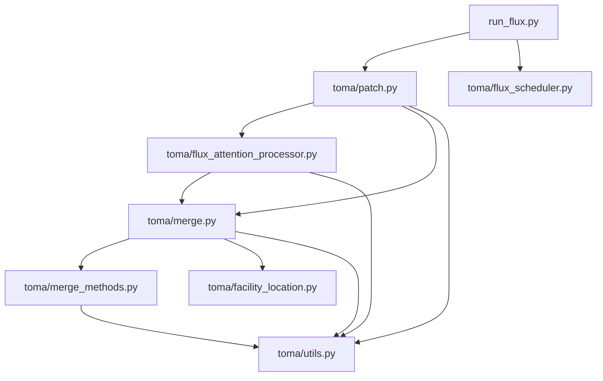

# ToMA

Token Merging for Attention (ToMA) provides utilities for applying token merging
techniques to the [FLUX](https://huggingface.co/black-forest-labs/FLUX.1-dev)
diffusion pipeline. The repository contains a patching mechanism and helper
modules for scheduling and performing token merge operations.

## Setup

The project targets Python 3.8+ and requires PyTorch, Diffusers and PyYAML. The
steps below describe a typical setup flow.

### 1. Clone the repository
```bash
git clone https://github.com/<your-org>/ToMA.git
cd ToMA
```

### 2. Create and activate a virtual environment
```bash
python -m venv .venv
source .venv/bin/activate  # On Windows use `.venv\Scripts\activate`
```

### 3. Install dependencies
Install the core libraries:
```bash
pip install torch diffusers pyyaml
```

### 4. Download the FLUX model weights
`run_flux.py` expects the FLUX model to be available locally. Download the model
through the Hugging Face CLI so that Diffusers can load it with
`local_files_only=True`:
```bash
huggingface-cli download black-forest-labs/FLUX.1-dev --local-dir ~/.cache/huggingface/hub
```

### 5. Configure ToMA
Adjust `config/config.yaml` and `config/flux.yaml` as needed. The default
`config.yaml` defines parameters such as the number of tiles and inference
steps, while `flux.yaml` describes the structure of the transformer blocks.

### 6. Generate images
Use the provided script to generate images with optional token merging:
```bash
python run_flux.py --prompt "A photo of a tench, a type of fish" --ratio 0.5 \
                   --output ./output --device cuda:0
```
See `python run_flux.py --help` for the full list of options.

## Module Dependency Graph



This graph illustrates how the major modules interact, from the entry point in
`run_flux.py` down to the helper utilities that implement token merging.

## Project Structure

- `run_flux.py` – example script that loads the FLUX pipeline, applies the ToMA
  patch and generates images.
- `toma/` – Python package containing the merging logic and utilities.
- `config/` – YAML configuration files for runtime options and model structure.

## License

This project is distributed under the MIT License.
